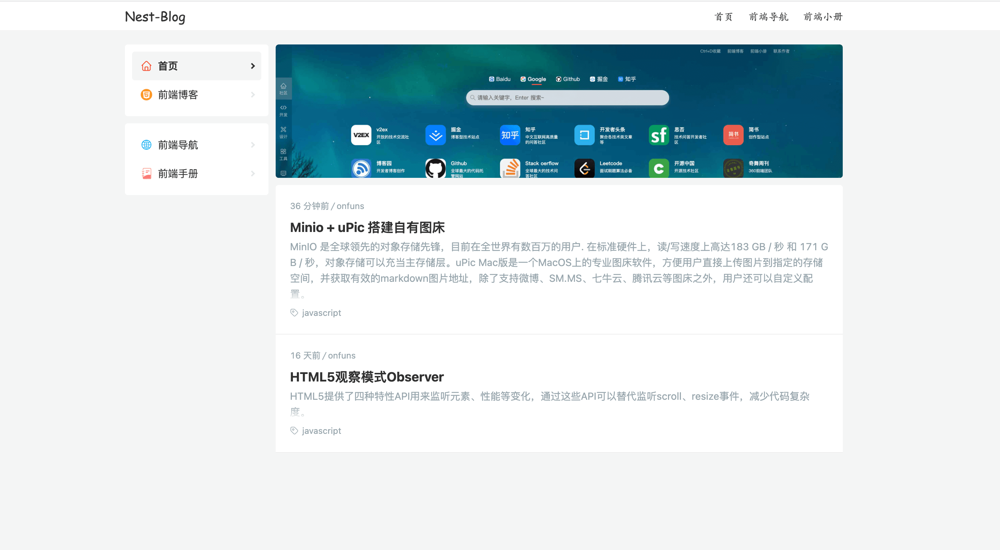
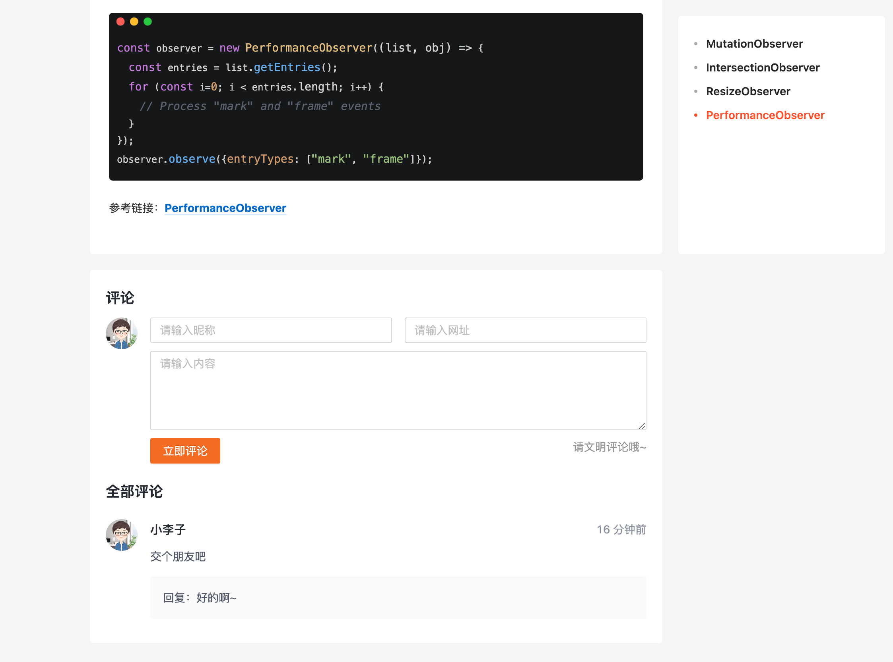
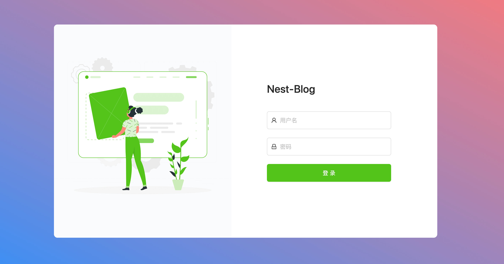
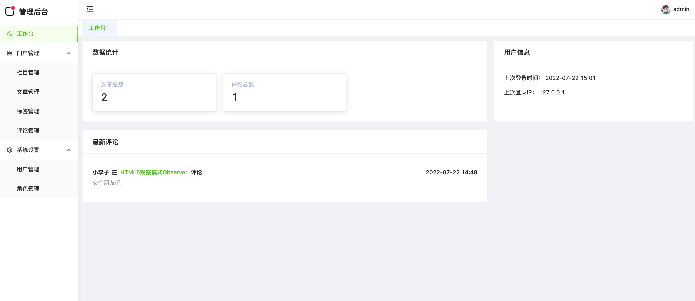
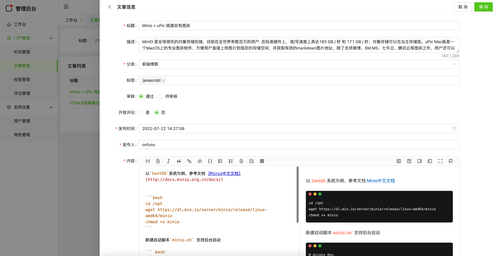

> 基于 NextJS + NestJS + Mysql 开发的博客系统，支持文章发布、分类、标签、评论、角色权限等功能，适合搭建博客或学习使用。

## 技术栈

- **Server**： `NestJS + TypeORM + Mysql` + `TypeScript`
- **Client**： `NextJS` + `React` + `Antd` + `Mobx` + `TypeScript`
- **Admin**： `UmiJS` + `React` + `Antd` + `Mobx` + `TypeScript`

## 预览

#### 前台

- 地址： [https://demo.onfuns.com](https://demo.onfuns.com)

- 首页

  

- 评论页

  

#### 后台

- 地址：[https://demo.onfuns.com/admin/login](https://demo.onfuns.com/admin/login) (demo/a123456)

- 登录页

  

- 首页

  

- 文章页

  

## 启动

分别进入 `server`、`client`、`admin` 对应目录启动

```bash
# 开发
$ npm run dev
# 生产
$ npm run start:prod
```

## 构建

可分别进入各子目录单独构建，也可以在项目根目录统一构建，如在根目录分别执行

```bash

$ npm run build:admin
$ npm run build:server
$ npm run build:client
```

## 部署

上传 `dist` 目录到服务器，同时参考 `nginx.conf` 设置代理，或自己集成 `docker` 启动

```bash
$ sudo npm install pm2 -g
$ cd client && npm install --production && npm run start:prod
$ cd server && npm install --production && npm run start:prod
```

## 数据库配置

新建数据库`nest_blog`，本地可以导入 `server` 中的初始化数据 `init.sql`。本地数据库默认配置 `server/src/config/dev.ts` 。生产环境在 `server`目录新建 `.env.production` 文件，按需更改

```bash
DB_HOST = localhost
DB_USER = xxxxxx
DB_PASS = xxxxxx
DB_DATABASE = nest_blog
JWT_TOKEN = xxxxxxxxxxxx
```

## 功能分类

#### 后台功能

- [x] 文章增删改查
- [x] 分类增删改查
- [x] 标签增删改查
- [x] 评论增删改查
- [x] 登录 token 校验
- [x] 权限增删改查
- [x] 用户增删改查
- [x] 首页面板统计
- [x] 权限校验

#### 前台功能

- [x] 文章展示
- [x] 分类
- [x] 评论
